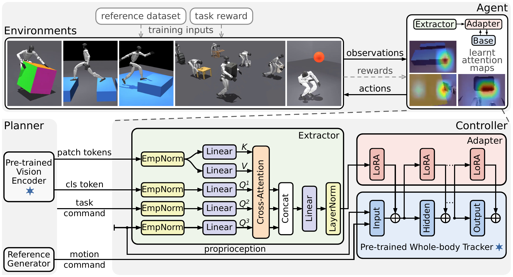

# architecture

 extractor -> LoRA adapter on the frozen tracker">

```
 head cam ─► frozen encoder ─► kv_tokens (B, P, C) ───┐
                                                     ├─► extractor ─► z (128, LayerNorm)
 query groups: q_task_cmd · q_proprio · q_cls ───────┘                 │
                                                                       ▼
 augmentation (motion command) ──────────────────────────────────► adapter (LoRA)
                                                                       │ ΔW
 policy + tokenizer streams ────────────────────────────────────► frozen SONIC base ─► actions
```

| block | trains | notes |
|---|---|---|
| base | ✗ | SONIC whole-body tracker (mocke): tracks a reference motion |
| adapter | ✓ | LoRA on the base's decoder, zero-init, so the untrained policy IS the base (`play --agent initial`) |
| extractor | ✓ | cross-attention: one attention row per query group over the image tokens. A query steers *where to look*; its value never enters z |
| encoder | ✗ | Theia-tiny by default, computed env-side outside autograd. At the 112x63 head cam a stride-16 backbone gives P = 7x3 = 21 tokens |
| critic | ✓ | privileged (object / ball state, height scan); never deployed |

## observation groups

| group | contents | read by |
|---|---|---|
| `policy` · `tokenizer` | proprio history · future reference window (SONIC's contract) | base |
| `augmentation` | the motion command: per-body contact flags + root twist (dodge has none) | adapter |
| `kv_tokens` | encoder patch tokens | extractor K/V |
| `q_task_cmd` | the goal: up-face colour (repose), goal pose (uolm), root twist (perloco) | extractor query |
| `q_proprio` · `q_cls` | single-frame proprio · the encoder's global token | extractor query |
| `camera` | raw RGB (`ImgRgb` only) | CNN |
| `critic` | privileged full state | critic |
| `prediction_target` · `prediction_conditioning` | aux target · aux conditioning (`Sfd`, `Lfd`) | predictor, train only |

A trainable block's input is a whole obs group, named in the cfg, never a slice. A new
vision stack is one `EXTRACTOR_CFGS` entry in `vibe.core.rl`, with no rsl_rl change.

## aux objectives (repose)

| | `-Sfd` · StateFdAux | `-Lfd` · LatentFdAux |
|---|---|---|
| predicts, K = 10 steps | object state + up-face colour + task-reward rates + hand contact force | z, against an EMA target |
| loss | L1 on the normalized target | MSE on the LayerNorm'd latent |

Both train the extractor after every PPO minibatch; the predictor is dropped at deploy.
Targets are ego-observable (base frame, hands only) and the conditioning holds no object
state, so the object half of the target is reachable only through the image.

## render domain

| per env, training only | under `play` |
|---|---|
| camera mount, ±2 cm / ±2° | off |
| sun direction, ~14° cone | off |
| floor colour from a 16-entry palette; raised terrain draws a colour ≥ 100 rgb apart | pinned to one slate "stage" colour, the same for every task |
| repose's cube face→colour permutation (the task channel, not a domain) | kept |

`assert_play_is_clean` fails a play cfg build if vibe added any training domain to it.

The policy's frames come from mujoco_warp's rasterizer. The interactive viewer is a different
renderer and ignores these limits:

- `texture > mat_rgba > geom_rgba`, so recolouring needs the texture gone (`flat_floor`);
- alpha is not rendered, so a translucent object renders opaque;
- light intensity and sky colour cannot vary per env.
