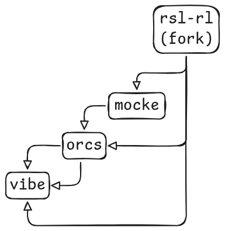

# Dependency graph — who owns which question



```
rsl_rl ──► mocke ──► orcs ──► vibe          one direction, always
 algos     frozen    privileged   vision
           WBC       tasks
```

**A term is defined in exactly ONE repo. A duplicate across two is a bug, not a convenience.**

| repo | owns | never contains |
|---|---|---|
| **rsl_rl** (fork) | every agent-side algo, for all child projects | anything env- or task-shaped |
| **mocke** | the mdp re-implementation of pre-trained whole-body trackers | robot library content — contact geometry, body-name sets, terminations |
| **orcs** | privileged oracle tasks + the state-based agent zoo | images, RGB, vision agents |
| **vibe** | everything downstream of a camera | any orcs term, re-implemented |

## the lock rule

**Shared deps are one editable install per venv, so the LEAF's `deps.lock` wins.** vibe's is
authoritative for `assets` / `retargeted_motions` / `mocke` / `rsl_rl`; orcs's lock serves a
standalone orcs checkout and records what it was *validated* against (`orcs.core.deps`, which
prints the live-vs-validated diff at import).

> Independent work on a parent belongs in **its own venv**. Sharing one venv means the child's
> lock silently decides the parent's behaviour.

Bumping, drift and the verify pass: [setup.md](setup.md).

## rsl_rl — the algo layer

| slot | ships |
|---|---|
| base actors | ModNorm MLP · SONIC |
| actor augmentations | adapter (LoRA) · sidecar (action residual) |
| extension modules | extractor · predictor |
| auxiliary objectives | `StateFdAux` (`-Sfd`) · `LatentFdAux` (`-Lfd`) |
| diagnostics | the extractor-owned `Z*` sections ([../perception/metrics.md](../perception/metrics.md)) |

## mocke — the frozen-WBC layer

Sounds like *mock* for a reason. Pre-training of a whole-body tracker:

- **share** — the big retargeted dataset (standard `motion.npz`) + the flat-ground environment
- **vary** — command conditioning, agent architecture, minimal reward variations

Two jobs, and nothing else:

1. the **inference infra** for child projects — any extension or porting happens here
2. an mjlab implementation for **pre-training**, should we need it

It carries the obs/action contract the ported SONIC checkpoints are **bit-coupled** to, which
is why its drift line is the one to believe.

## orcs — the privileged task layer

Purely state-based. Two axes:

1. training privileged state-based policies across tasks
2. PEFT via LoRA over SONIC — `robot` command space from robot-motion, `smpl` from human-motion

Every task slot orcs owns has a vibe twin one obs group away; the roster of both lives in
[naming.md](naming.md) and in each task's registration docstring, never here.

## vibe — the vision layer

Visual behavior adaptation of **sys0**. Owns:

1. the frozen encoder, the extractor, PPOAux, the colour task channel
2. the render domain ([../perception/render_domain.md](../perception/render_domain.md))
3. a thin per-task layer over orcs: set the dataset, attach the camera, swap ONE obs group

No from-scratch baselines here — those are orcs's, where oracle policies belong.
