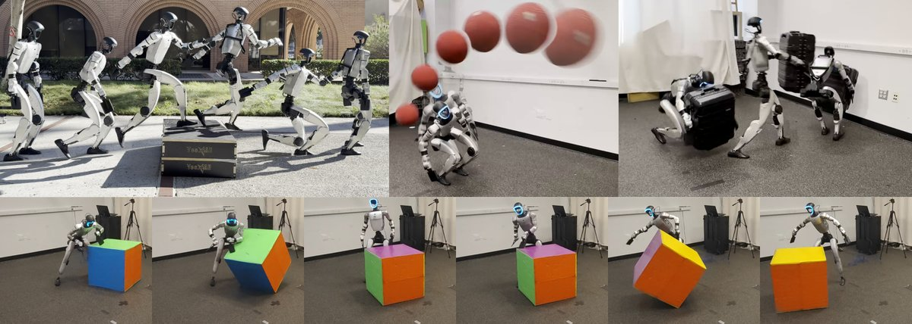
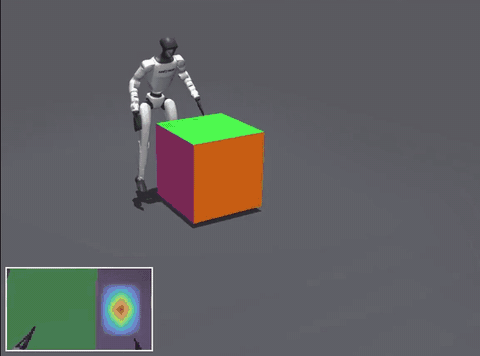
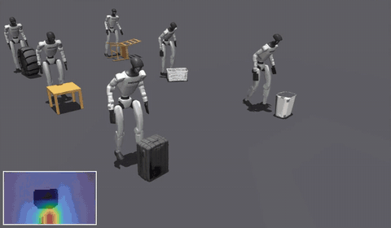
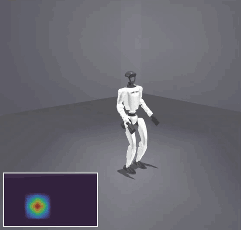
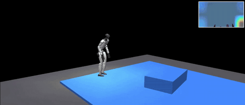
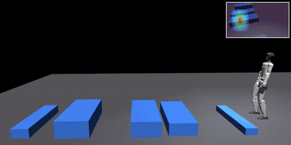

# vibe

[](https://arxiv.org/abs/2609.09918)
[](https://lok-i.github.io/vibe-control/)
[](https://lok-i.github.io/vibe-control/#demo)
[](https://huggingface.co/lkrajan/vibe)
[](LICENSE)



implementation accompanying *ViBe: **Vi**sual **Be**havior Adaptation for Perceptive Humanoid Whole-Body Control*.

## install

Requires [uv](https://docs.astral.sh/uv/getting-started/installation/) and Git LFS; uv fetches
Python itself.

```bash
git clone https://github.com/lok-i/vibe && cd vibe
uv venv --prompt vibe
source .venv/bin/activate
bash scripts/setup/sync_deps.sh     # Vibe + pinned deps
bash scripts/setup/sync_data.sh     # all | inhouse | omre | grail
```

data modes, dependencies, troubleshooting: [docs/setup.md](docs/setup.md).

## usage

```bash
# train
list-envs                                   # task ids
train Vibe-Repose-BigCubeFloor-ImgFeat-Ext --env.scene.num-envs 4096 \
  --agent.max-iterations 60000 --env.commands.motion.init-phase-anneal-iterations 50000 \
  --agent.wandb-project vibe

# play
play Vibe-Repose-BigCubeFloor-ImgFeat-Ext --agent release --viewer native
play Vibe-Uolm-ImgFeat-Ext --agent initial --viewer native
```

| arg | options |
|---|---|
| `--agent` | `auto` · `initial` · `release` · `trained` · `zero` · `random` |
| `--checkpoint-file` · `--wandb-run-path` | for `trained` |
| `--viewer` | `auto` · `native` · `viser` (also [records clips](docs/record.md)) |
| `--env.img-encoder` (train) | [backbones](docs/tasks.md#encoders); default Theia-tiny |
| `--agent.logger` (train) | `wandb` · `tensorboard`; [reading the metrics](docs/metrics.md) |

- checkpoints: [`lkrajan/vibe`](https://huggingface.co/lkrajan/vibe), one per task
- `--agent release`: fetched on first use into `~/.cache/vibe/releases`
- all up front: `bash scripts/setup/download_released_models.sh`
- train commands, every task: [docs/tasks.md](docs/tasks.md#train)

### export ONNX

```bash
bash scripts/setup/sync_deps.sh --deploy           # + onnxruntime
export-agent   <task-id> --release                 # policy -> exports/agent/<task-id>/
export-agent   <task-id> --release --viewer native # + watch the two-world check
export-encoder --tag theia-tiny                    # vision backbone -> exports/enc/
```

for deployment support, see: [docs/export.md](docs/export.md).

### test

```bash
ruff check src tests    # lint (also CI)
pytest tests/           # contracts over the synced data; no GPU, ~7 s
```

## tasks

<table>
  <tr>
    <td align="center">
      <a href="src/vibe/tasks/repose"></a><br>
      <sub><code>Vibe-Repose-BigCubeFloor-ImgFeat-Ext</code></sub>
    </td>
    <td align="center">
      <a href="src/vibe/tasks/uolm"></a><br>
      <sub><code>Vibe-Uolm-ImgFeat-Ext</code></sub>
    </td>
    <td align="center">
      <a href="src/vibe/tasks/dodge"></a><br>
      <sub><code>Vibe-Dodge-ConeFast-ImgFeat-Ext</code></sub>
    </td>
  </tr>
</table>
<table>
  <tr>
    <td align="center">
      <a href="src/vibe/tasks/perloco"></a><br>
      <sub><code>Vibe-PerLoco-OmRe-ImgFeat-Ext</code></sub>
    </td>
    <td align="center">
      <a href="src/vibe/tasks/perloco"></a><br>
      <sub><code>Vibe-PerLoco-Grail-ImgFeat-Ext</code></sub>
    </td>
  </tr>
</table>

## contribute

We welcome contributions, be it an item on our
[roadmap](docs/roadmap.md) or new features. Feel free to open an issue/PR.

## license

Code: [BSD-3-Clause](LICENSE). Third-party models, data and the released checkpoints keep their
own terms: [THIRD_PARTY_NOTICES.md](THIRD_PARTY_NOTICES.md).
